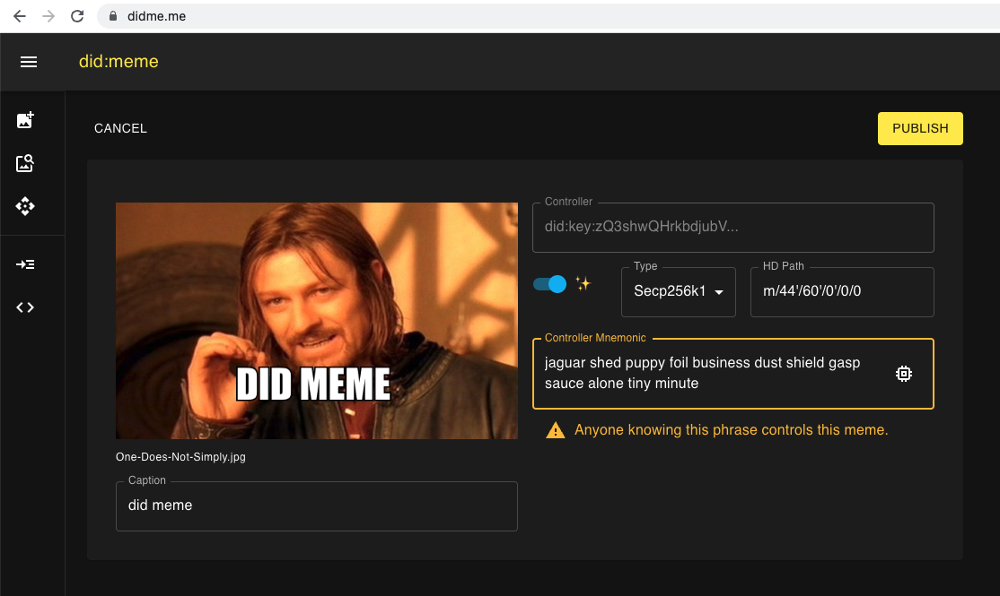

## [didme.me](https://didme.me)

> The Decentralized Identifiers (DIDs) are a new type of globally unique identifier designed to enable individuals and organizations to generate our own identifiers using systems we trust, and to prove control of those identifiers (authenticate) using cryptographic proofs.

- [W3C DID Core Spec](https://www.w3.org/TR/did-core/)

- [W3C CCG Mailing List Announcement](https://lists.w3.org/Archives/Public/public-credentials/2020Jul/0092.html)

### [DID Meme Example](https://didme.me/did:meme:1zgswzdje885tzr8408m37sjmaa0sthw265ty6hmwzmau48kd809zzrgra4w5w)

### Meta Mask Interoperability

🔥🔥 Highly Experimental 🔥🔥

You can set the Key Type to "secp256k1" and the "HD Path" to "m/44'/60'/0'/0/0".

If you import the mnemonic into metamask, you can control the associated ethereum address.

MetaMask will not let you change the hd path, and does not support Ed25519, so be carefuly exploring this feature.

Technically, this interop is "did:key" interop since any secp256k1 public key has an ethereum address.

Saddly, not all ethereym addresses are easily accessed via wallets such as metamask,
so it is possible to generate an address that won't be easy to recover funds from without some scripting skill.

Here is an example [did:meme:1zgsfmn2g4797kzd4k6mkxq5d3u28cysj8m764j5g2z2tfpeyggdmhvq383e7u](https://didme.me/did:meme:1zgsfmn2g4797kzd4k6mkxq5d3u28cysj8m764j5g2z2tfpeyggdmhvq383e7u).



## DID Method Spec

`did:meme` is a deterministic transformation of `did:key`, that uses IPFS, image content and bech32.

### DID Format

```
did-meme-format := did:meme:<bech32-value>
bech32-value    := [a-zA-HJ-NP-Z0-9]+
```

The `bech32-value` is an encoded [multihash](https://multiformats.io/multihash/).

The `multihash` is a content identifier for an image.

The image contains a steganographically embedded `did:key`.

See [did-key](https://w3c-ccg.github.io/did-method-key/#format).

Another way of representing the `did:meme` identifier encoding:

```
did:meme:<bech32(
    multihash(
        stego-embed(image, did:key)
    )
)>
```

### DID Operations

See [did-key](https://w3c-ccg.github.io/did-method-key/#operations).

#### Create

1. Generate a `did:key`
2. Steganographically embed the public key multicodec representation in a meme.
3. Upload the meme to ipfs.
4. Transform the CID to a `did:meme` with bech32.
5. Update the did document to use the `did:meme` identifier.

#### Read

1. Convert the bech32 id to an ipfs CID.
2. Resolve the image.
3. Extract the `did:key` multicodec.
4. Construct the `did:key` document from the identifier.
5. Update the did document to use the `did:meme` identifier.

#### Update

Not supported.

#### Deactivate

Not supported.

### Security and Privacy Considerations

See [did-key](https://w3c-ccg.github.io/did-method-key/#security-and-privacy-considerations)

#### Security

Because update and deactivate are not supported, did:meme should only be used for very short lived interactions, or just lulz.

Because `did:meme` identifiers are a super set of `did:key`, it is possible for multiple `did:meme` to map to the same `did:key`... This can be problematic when private key compromise has occured.

Generally speaking, `did:meme` has similar or weaker security properties compared with `did:key`.

#### Privacy

Be careful to strip XIF data or other meta data from images before constructing `did:meme`.

Do not use images that identify physical locations or people.

# Boilerplate

This is a [Next.js](https://nextjs.org/) project bootstrapped with [`create-next-app`](https://github.com/vercel/next.js/tree/canary/packages/create-next-app).

## Getting Started

First, run the development server:

```bash
npm run dev
# or
yarn dev
```

Open [http://localhost:3000](http://localhost:3000) with your browser to see the result.

You can start editing the page by modifying `pages/index.tsx`. The page auto-updates as you edit the file.

[API routes](https://nextjs.org/docs/api-routes/introduction) can be accessed on [http://localhost:3000/api/hello](http://localhost:3000/api/hello). This endpoint can be edited in `pages/api/hello.ts`.

The `pages/api` directory is mapped to `/api/*`. Files in this directory are treated as [API routes](https://nextjs.org/docs/api-routes/introduction) instead of React pages.

## Learn More

To learn more about Next.js, take a look at the following resources:

- [Next.js Documentation](https://nextjs.org/docs) - learn about Next.js features and API.
- [Learn Next.js](https://nextjs.org/learn) - an interactive Next.js tutorial.

You can check out [the Next.js GitHub repository](https://github.com/vercel/next.js/) - your feedback and contributions are welcome!

## Deploy on Vercel

The easiest way to deploy your Next.js app is to use the [Vercel Platform](https://vercel.com/new?utm_medium=default-template&filter=next.js&utm_source=create-next-app&utm_campaign=create-next-app-readme) from the creators of Next.js.

Check out our [Next.js deployment documentation](https://nextjs.org/docs/deployment) for more details.
