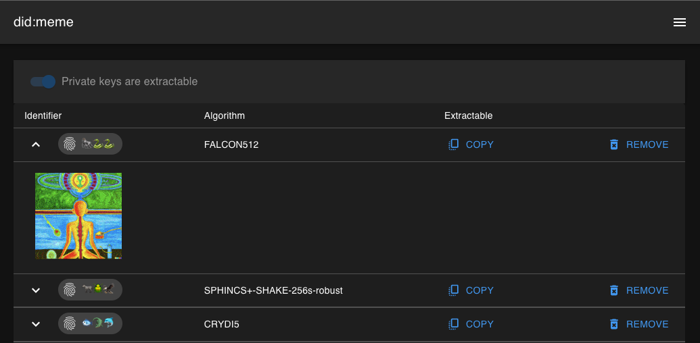

# did:meme

What's new in v2?

TLDR: DID Meme, is no longer a "DID Method".

In v2, DID Meme is simply a way to share `did:jwk` for experimental post quantum cryptography.

If you see an image on social media you think might have an identifier inside, you can try to "resolve" the identifier from the image itself.

If this process succeeds, you can decide to trust the identifier based on the context you have for it from social media.

For example: [twitter.com/OR13b/status/1584257036966973441](https://twitter.com/OR13b/status/1584257036966973441)
