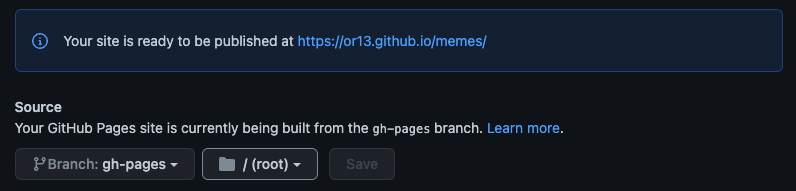

## Welcome to DID MEME

View the Source Code on [GitHub](https://github.com/OR13/didme.me).

Read the Documentation on [GitHub](https://or13.github.io/didme.me/).

Open the [Web App](https://didme.me).

### Review the Method Specification

See the [did:meme method specification](./did-method-spec.md)

### Using GitHub Pages

You should review [About GitHub Pages](https://docs.github.com/en/pages/getting-started-with-github-pages/about-github-pages).

Using Pages, you can convert a `did:meme` to a `did:web`.

You should beware that unlike `did:meme`, your public `did:web` identifier will be bound to your `github` username.

This means your actions will effect your reputation, and you should avoid embaressing yourself.

You should also review the [GitHub Community Guidelines](https://docs.github.com/en/site-policy/github-terms/github-community-guidelines).

#### Don't publish content that gets you banned.

If someone objects to one of your memes, remove it from GitHub, if you are worried about censorship, consider using a more decentralized platform.

#### First Time Setup

If this is your first time setting up Pages, you will need to enable it via the GitHub Dashboard.

Navigate to `https://github.com/YOUR_USERNAME_HERE/memes/settings/pages`.

Enable publishing from the `gh-pages` branch.

You may need to wait for the install script to publish this branch for you.

Once you have enabled publishing to pages, make sure to update your README

- Add a Deployment Badge for your DID Web.

### Using GitHub Actions

You should review [Understanding GitHub Actions](https://docs.github.com/en/actions/learn-github-actions/understanding-github-actions).

If you finished setting up github pages, you have already started using GitHub actions.

Actions help you program automation associated with your memes.

There are many actions you might find useful, here is a short list to start with.

- [actions-gh-pages](https://github.com/peaceiris/actions-gh-pages)
- [git-auto-commit-action](https://github.com/stefanzweifel/git-auto-commit-action)
- [verifiable-actions](https://github.com/transmute-industries/verifiable-actions)

### Using MetaMask

See the section on [experimental metamask interop](./metamask.md)

### Using Vercel

##### Coming Soon!

See the section on [vercel](./vercel-setup.md)
