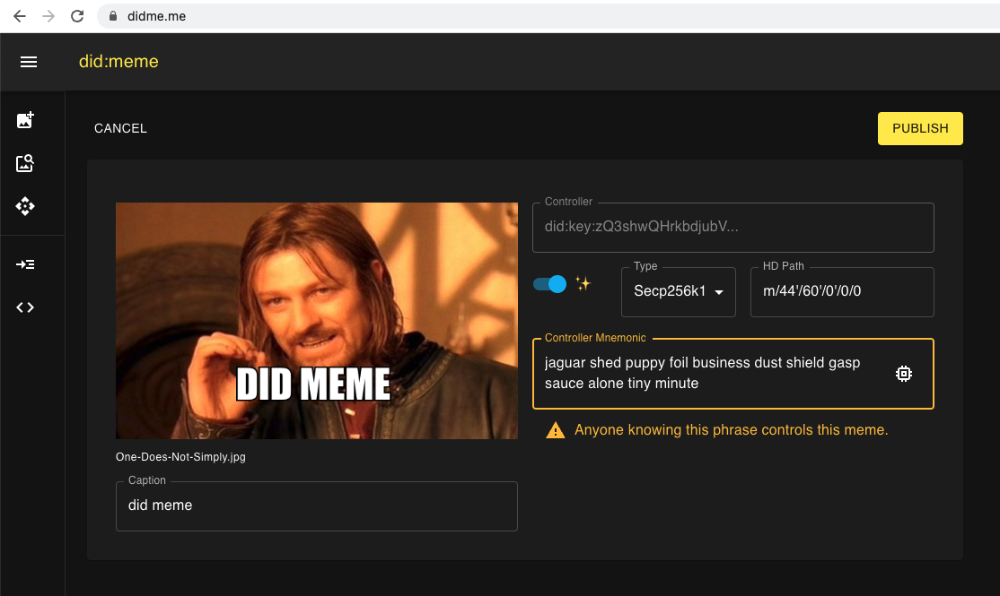

### Meta Mask Interoperability

🔥🔥 Highly Experimental 🔥🔥

You can set the Key Type to "secp256k1" and the "HD Path" to "m/44'/60'/0'/0/0".

If you import the mnemonic into metamask, you can control the associated ethereum address.

MetaMask will not let you change the hd path, and does not support Ed25519, so be carefuly exploring this feature.

Technically, this interop is "did:key" interop since any secp256k1 public key has an ethereum address.

Saddly, not all ethereym addresses are easily accessed via wallets such as metamask,
so it is possible to generate an address that won't be easy to recover funds from without some scripting skill.

###### Example DIDs

- [did:meme:1zgsfmn2g4797kzd4k6mkxq5d3u28cysj8m764j5g2z2tfpeyggdmhvq383e7u](https://didme.me/did:meme:1zgsfmn2g4797kzd4k6mkxq5d3u28cysj8m764j5g2z2tfpeyggdmhvq383e7u).

###### Example VCs

- [https://didme.me/v/eyJhb...2xOIACOWVzQ1woRQ](https://didme.me/v/eyJhbGciOiJFUzI1NksiLCJraWQiOiJkaWQ6bWVtZToxemdzemcyMGhqcDhwcWdmcTNuN3VwaGYzeTJmNTZxdHhjY2E0Z2w2ODdndXRsOTdwY204Z25ncThjem5xYSN6UTNzaFFxSkNuYjV6czUzek5XelZHN0NTTGhQc1lhc05ielpxM3B2bktWUFhSU3F3In0.eyJpc3MiOiJkaWQ6bWVtZToxemdzemcyMGhqcDhwcWdmcTNuN3VwaGYzeTJmNTZxdHhjY2E0Z2w2ODdndXRsOTdwY204Z25ncThjem5xYSIsInN1YiI6ImRpZDpleGFtcGxlOjEyMyIsInZjIjp7IkBjb250ZXh0IjpbImh0dHBzOi8vd3d3LnczLm9yZy8yMDE4L2NyZWRlbnRpYWxzL3YxIl0sImlkIjoidXJuOnV1aWQ6MDdhYTk2OWUtYjQwZC00YzFiLWFiNDYtZGVkMjUyMDAzZGVkIiwidHlwZSI6WyJWZXJpZmlhYmxlQ3JlZGVudGlhbCJdLCJpc3N1ZXIiOiJkaWQ6bWVtZToxemdzemcyMGhqcDhwcWdmcTNuN3VwaGYzeTJmNTZxdHhjY2E0Z2w2ODdndXRsOTdwY204Z25ncThjem5xYSIsImlzc3VhbmNlRGF0ZSI6IjIwMTAtMDEtMDFUMTk6MjM6MjRaIiwiY3JlZGVudGlhbFN1YmplY3QiOnsiaWQiOiJkaWQ6ZXhhbXBsZToxMjMifX0sImp0aSI6InVybjp1dWlkOjA3YWE5NjllLWI0MGQtNGMxYi1hYjQ2LWRlZDI1MjAwM2RlZCIsIm5iZiI6MTI2MjM3MzgwNH0.KKFxLeSvl5H9p3bvK14bHvbDWNKEOdrXfREgyBK9xmUO7aaDk7p3cmhfo57P06__4791oB2xOIACOWVzQ1woRQ)

### NFT Support

Image previews are currently only available in MetaMask Mobile.

Choose the "ropsten" network.

Enter the Contract Address: "0x06778A58A073E5173fac00f1CD4C673CEb176fb8"

Enter the TokenId, you can find this by following meta mask instructions.

