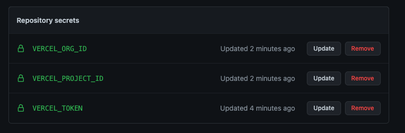

### Using Vercel

The [didme.me](https://didme.me) website is powered by [vercel](https://vercel.com).

In the future, we'll provide documentation on how run your own cloud agent using vercel.

If you are interested in helping write this documentation, we welcome pull requests.

Here is a short list of features that we think a vercel integration will unlock:

- [DIDComm v2](https://didcomm.org/)
- [Multi Lanaguage Service Endpoints for DIDs](https://vercel.com/docs/concepts/functions/supported-languages)
- [Verifable Credentials API](https://github.com/w3c-ccg/vc-api)

You will need to set GitHub Secrets for vercel deployment to succeed.

See https://github.com/marketplace/actions/vercel-action

VERCEL_TOKEN - see https://vercel.com/account/tokens
VERCEL_ORG_ID - see https://github.com/vercel/vercel/discussions/4367
VERCEL_PROJECT_ID - see https://github.com/vercel/vercel/discussions/4367

